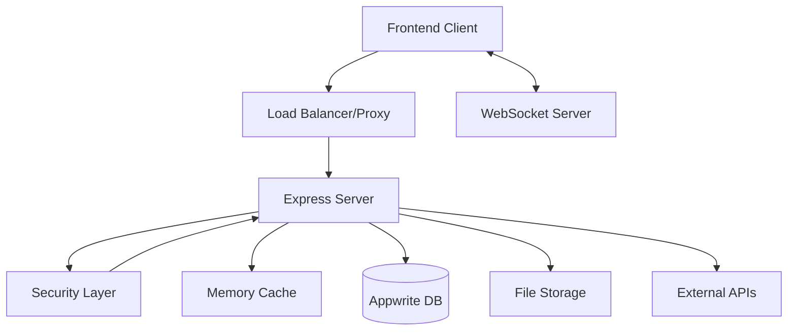

# 🇮🇳 Netakhoj - India's Premier Electoral Intelligence Platform

<div align="center">


[](https://fixkaro-web-production.up.railway.app/)
[](https://fixkaro-web-production.up.railway.app/)
[](https://fixkaro-web-production.up.railway.app/)

## Discover Your Representatives  
Interactive Electoral Intelligence & Constituency Analytics

[🌐 Live Demo](https://netakhoj-web-production.up.railway.app/)


> **⚠️ Development Notice**: Netakhoj is currently in active development. You may experience some bugs or temporary service interruptions as we continuously improve the platform.

</div>

---

## 🎯 **What is Netakhoj?**

**Netakhoj** is India's premier electoral intelligence platform that transforms how citizens discover and connect with their representatives. Our cutting-edge web application provides comprehensive, real-time access to India's democratic landscape through interactive maps, detailed analytics, and intelligent search capabilities. Netakhoj serves as thegateway to electoral information in India.

### 🌟 **Why Netakhoj?**

- **🗺️ Interactive Maps**: Navigate through all 543 parliamentary and 4,120+ assembly constituencies.
- **📊 Live Analytics**: Real-time statistics on political representation across India.
- **🔍 Smart Search**: Find representatives by name, constituency, or party affiliation.
- **📊 Automated Data Aggregation**: Aggregates and processes publicly available data from various online sources to provide comprehensive insights.
- **🛡️ Secure & Reliable**: Enterprise-level security with custom threat detection and Appwrite integration.
- **⚡ Real-time Updates**: Live data synchronization via WebSockets.

### 🌟 **Key Features**

#### 🗺️ **Interactive Constituency Mapping**
- **Dual Map Views**: Switch between Lok Sabha (Parliamentary) and Vidhan Sabha (Assembly) constituencies.
- **Real-time GeoJSON Rendering**: High-performance mapping with Leaflet.js.
- **Boundary Visualization**: Precise constituency boundaries with hover and click interactions.
- **Responsive Design**: Optimized for desktop, tablet, and mobile devices.

#### 📊 **Comprehensive Analytics Dashboard**
- **National Overview**: Live statistics on MPs, MLAs, and party distributions.
- **Party Analytics**: Detailed breakdown by Lok Sabha, Rajya Sabha, and State Assemblies.
- **Constituency Insights**: Click-to-explore detailed constituency information.
- **Real-time Updates**: WebSocket-powered live data synchronization.

#### 🔍 **Advanced Search & Intelligence**
- **Multi-source Search**: Local database + Electoral Commission integration.
- **Smart Suggestions**: Intelligent autocomplete with constituency, candidate, and party matching.
- **Electoral Intelligence**: Direct integration with official candidate registries.
- **Criminal Record Alerts**: Transparency indicators for informed voting decisions.

#### 🛡️ **Enterprise Security**
- **Custom Security Manager**: In-house developed security layer for threat detection.
- **IP Blocking & Rate Limiting**: Intelligent request throttling and automatic IP blocking for suspicious behavior.
- **Input Sanitization**: rigorous validation against XSS, SQL Injection, and Path Traversal attacks.
- **Audit Logging**: Comprehensive tracking of security events and anomalies.

#### ⚡ **Performance & Scalability**
- **Image Proxy Service**: Custom proxy to securely fetch and cache images, handling timeouts and format conversions.
- **Memory Monitoring**: Real-time performance tracking and alerts.
- **Caching Layer**: Multi-level caching (Node-cache) for optimal response times.
- **Background Cleanup**: Automated log and storage management to maintain system health.

---

## 🏗️ **Architecture Overview**



### 🛠️ **Technology Stack**

#### **Backend**
- **Runtime**: Node.js 20+ with ES Modules
- **Framework**: Express.js
- **Database**: Appwrite (NoSQL), Local File System (JSON)
- **Real-time**: Native WebSocket (ws)
- **Security**: Helmet, CORS, Custom Security Manager
- **Logging**: Winston with daily rotation

#### **Frontend**
- **Core**: HTML5, CSS3, Vanilla JavaScript
- **Mapping**: Leaflet.js
- **Styling**: Custom CSS (Responsive)
- **Icons**: Font Awesome 6+

#### **Data Processing**
- **Scraping**: Puppeteer, Cheerio
- **Data Collection**: Advanced Web Scraping & Parsing
- **Image Processing**: Custom Image Proxy with retry logic
- **PDF Generation**: Dynamic document creation

#### **DevOps**
- **Deployment**: Railway
- **Containerization**: Docker
- **Monitoring**: Custom Memory Monitor

---

## 🚀 **Quick Start**

### Prerequisites
- Node.js 20.0.0 or higher
- npm or yarn package manager
- Git

### Installation

```bash
# Clone the repository
git clone https://github.com/Rex1671/NetaKhoj.git
cd netakhoj-web

# Install dependencies
npm install

# Configure environment
cp .env.example .env
# Edit .env with your configuration (see below)

# Start development server
npm run dev

# Or start production server
npm start
```

### Environment Configuration

Create a `.env` file in the root directory with the following variables:

```env
# Server Configuration
PORT=3000
NODE_ENV=development # or production

# Security
ADMIN_TOKEN=your_secure_admin_token
BEHIND_PROXY=false # Set to true if behind Nginx/Cloudflare

# External APIs
GOOGLE_AI_API_KEY=your_google_ai_key

# Appwrite Configuration
APPWRITE_ENDPOINT=https://cloud.appwrite.io/v1
APPWRITE_PROJECT_ID=your_project_id
APPWRITE_API_KEY=your_api_key

# Logging
LOG_TO_FILE=true
```

---

## 📊 **Data Sources & Integration**

### **Primary Data Sources**
- **Election Commission of India**: Official candidate registries and electoral data.
- **Government Databases**: Official parliamentary and state assembly records.
- **Appwrite Database**: Stores persistent user and candidate data.

### **Real-time Integration**
- **WebSocket Updates**: Live data synchronization for connected clients.
- **Automated Scrapers**: Periodic updates from official sources using Puppeteer/Cheerio.

---

## 🔒 **Security Features**

### **Threat Detection System**
The application includes a custom `SecurityManager` class that handles:
- **Pattern Matching**: Detects malicious patterns (SQLi, XSS, Shell Injection) in requests.
- **Behavioral Analysis**: Tracks suspicious activity scores per IP.
- **Automatic Blocking**: Temporarily blocks IPs that exceed threat thresholds.

### **Production Hardening**
- **Helmet.js**: Sets secure HTTP headers.
- **CORS Policy**: Restricts access to trusted domains.
- **Rate Limiting**: Prevents abuse of API endpoints.

---

## 🤝 **Contributing**

We welcome contributions! Please see our [Contributing Guidelines](CONTRIBUTING.md) for details.

1.  Fork the repository.
2.  Create your feature branch (`git checkout -b feature/amazing-feature`).
3.  Commit your changes (`git commit -m 'Add some amazing feature'`).
4.  Push to the branch (`git push origin feature/amazing-feature`).
5.  Open a Pull Request.

---

## 📄 **License**

This project is licensed under the MIT License - see the [LICENSE](LICENSE) file for details.

---

## 🙏 **Acknowledgments**

- **Election Commission of India** for electoral data.
- **OpenStreetMap** contributors for mapping data.
- **Leaflet.js** community for the amazing mapping library.
- **Appwrite** for backend services.

---

<div align="center">

**Made with ❤️ for Indian Democracy**

*Empowering citizens with transparent, accessible electoral information*

</div>
